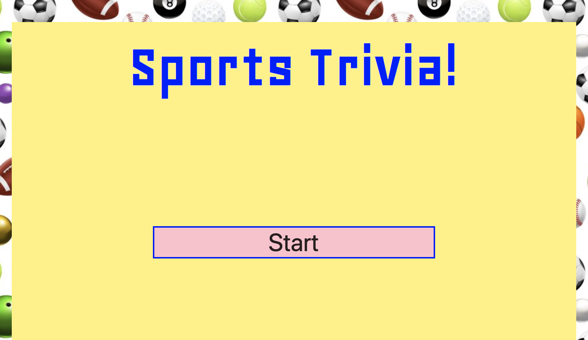
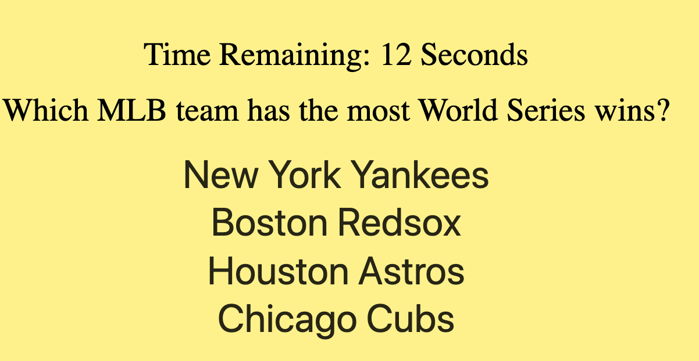
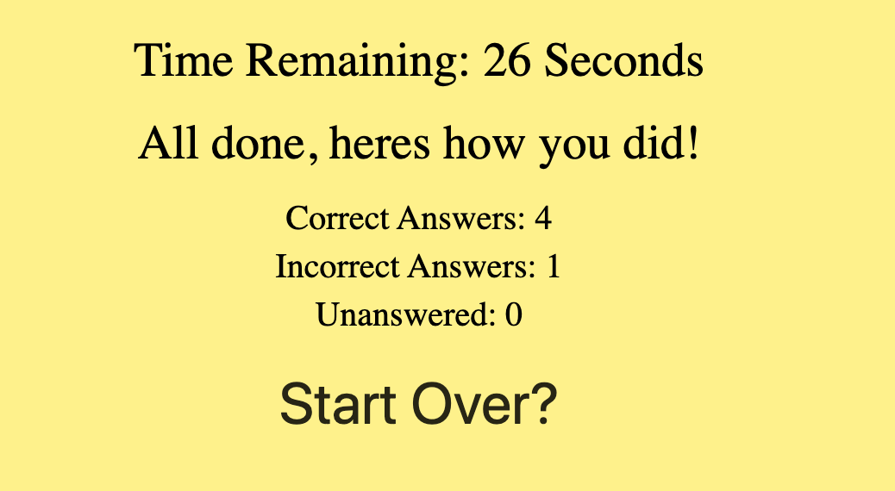

# Sports Trivia!

Link To Deployed Site: https://ericv0801.github.io/Safariya/
## Summary

Sports Trivia, is a front end web application game about sports where the user has to answer the questions correctly before the timer runs out. At the end of the game the user is able to see how many questions they got correct, and how many incorrect.

## Instructions
1) Click "Start".

2) Answer question before timer runs out.

3) Once all ten questions are answered, to play again simply click "start over".

## Technologies Used

- HTML
- CSS
- Javascript

 ##
 
 
 
 
## Authors
Eric Max Valdivia - https://github.com/Ericv0801

